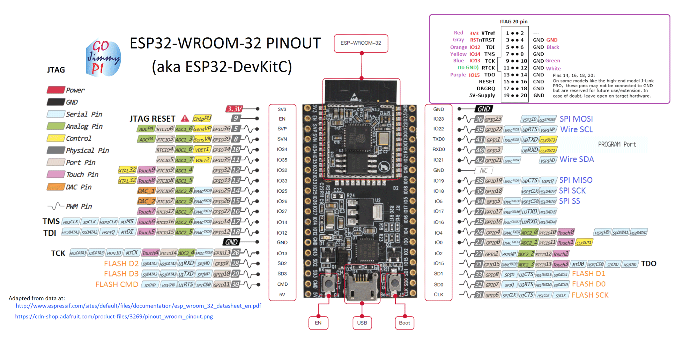

# Playing with Arduinos

### Purchasing my Arduino

For my Arduino projects, I use the ELEGOO Arduino Mega 2560 bought on Amazon as a set [here](https://www.amazon.co.jp/gp/product/B06Y5SM5D6/ref=ppx_yo_dt_b_asin_title_o00_s00?ie=UTF8&psc=1). This set comes with a lot of different sensors and some actuators, so it is a good way to get a feel of what can be done with the Arduino. On the [ELEGOO website](https://www.elegoo.com/download/), you can download the starter tutorials and files in the bundle called "Elegoo Mega 2560 The Most Complete Starter Kit".


On my local Macbook, Arduino files will be placed in `~/Documents/arduino` and all other IoT project related files will be under `~/Developer/iot/`.

### Setting up an Arduino development environment on Macbook Catalina.

Initially, I tried using the online version of the Arduino IDE called `Arduino Create`. I installed the Arduino Plugin as instructed but could not get the online platform to detect my Arduino Mega. This seems to be an ongoing [issue](https://github.com/arduino/arduino-pro-ide/issues/60).

My local standalone Arduino IDE was also shutting down often and not working properly, so I updated my Mac from Catalina 10.15.3 to Catalina 10.15.4. I deleted all the Arduino IDE related files and re-installed the standalone IDE. Seems to be workign fine from there.

## Creating a IoT sensor network environment!

So after fiddling with the Arduino for a bit, I wanted to create a simple IoT sensor network environment for myself. The IoT module, composed of sensors and the WiFi module \(ESP32\) will upon connecting to a local WiFi network, send sensor data to a server every few seconds or minutes. I wanted to then make a Web interface where I can see real-time data in graphs.

The process flow of the system is as follows:

1. The IoT device \(ESP32 and DHT11\) will be connected to power, and upon reset, will proceed to connect to the home wireless WiFi network.
2. If successful, the DHT11 sensor would retreive the temperature and humidity data.
3. The data will be jsonified and sent as a POST request to the predefined API server.
4. The API server will receive the request, save the temp and humidity data in the local SQLite database, and send a response back to the Iot device with the status message. 
5. Steps 2 to 4 will be repeated every 5 seconds as long as the IoT device is powered.

A Web interface on the API server would enable users to view real-time data in the form of graphs, making the entire experience more engaging.

All the source code of the API server will be on Github here: [yuasabe/iot\_api](https://github.com/yuasabe/iot_api). I will upload the Arduino files as well.

### Using the DHT11 Temperature and Humidity Sensor

We will try using the DHT11 Temperature and Humidity Sensor. The sensor itself is pretty small.


The wiring is as follows. Very simple, just connect signal, VCC, GND pin to the corresponding pins on the Arduino.


Loaded the example program that came with ELEGOO and got it up and running in no time. The temperature and humidity was displayed on the serial monitor every 4 seconds.

```c
//www.elegoo.com
//2018.10.25


#include <dht_nonblocking.h>
#define DHT_SENSOR_TYPE DHT_TYPE_11

static const int DHT_SENSOR_PIN = 2;
DHT_nonblocking dht_sensor( DHT_SENSOR_PIN, DHT_SENSOR_TYPE );


/*
 * Initialize the serial port.
 */
void setup( )
{
  Serial.begin( 9600);
}


/*
 * Poll for a measurement, keeping the state machine alive.  Returns
 * true if a measurement is available.
 */
static bool measure_environment( float *temperature, float *humidity )
{
  static unsigned long measurement_timestamp = millis( );

  /* Measure once every four seconds. */
  if( millis( ) - measurement_timestamp > 3000ul )
  {
    if( dht_sensor.measure( temperature, humidity ) == true )
    {
      measurement_timestamp = millis( );
      return( true );
    }
  }

  return( false );
}


/*
 * Main program loop.
 */
void loop( )
{
  float temperature;
  float humidity;

  /* Measure temperature and humidity.  If the functions returns
     true, then a measurement is available. */
  if( measure_environment( &temperature, &humidity ) == true )
  {
    Serial.print( "T = " );
    Serial.print( temperature, 1 );
    Serial.print( " deg. C, H = " );
    Serial.print( humidity, 1 );
    Serial.println( "%" );
  }
}
```

### Using the ESP32 Dev-Kit Module for WiFi

* [ESP32-DevKitC V4 Getting Started Guide](https://docs.espressif.com/projects/esp-idf/en/latest/esp32/hw-reference/esp32/get-started-devkitc.html)

Connect the ESP32 Dev-Kit module \(1500 yen\) to Macbook with a Micro USB cable.


Set up Arduino IDE by loaded external boards and choosing as per the link.

[Installing the ESP32 Board in Arduino IDE \(Mac OS X and Linux instructions\)](https://randomnerdtutorials.com/installing-the-esp32-board-in-arduino-ide-mac-and-linux-instructions/)

Open "WiFiScan" from code Examples, and compile and upload. A list of avalaible WiFi SSIDs should be displayed on the serial monitor. \(Removing the SSID names in the picture below.\)


### Use ESP32 with DHT11

The ESP32 DevKit board can be used as an Arduino itself, since it has all the necessary parts to hold programs and execute the. Here, we will use the ESP32 DevKit as the "Arduino" and connect the DHT11 sensor directly to the ESP32 Devkit board. Just plug in the 3V3, GND, and signal port to a GPIO 4 port and we're set.



[ESP32 Devkit Ports](https://components101.com/microcontrollers/esp32-devkitc)

Used this tutorial. [ESP32 with DHT11/DHT22 Temperature and Humidity Sensor using Arduino IDE](https://randomnerdtutorials.com/esp32-dht11-dht22-temperature-humidity-sensor-arduino-ide/)

This tutorial used the following two libraries to use the DHT11 sensor.

* [DHT Sensor Library](https://github.com/adafruit/DHT-sensor-library)
* [Adafruit Unified Sensor Lib](https://github.com/adafruit/Adafruit_Sensor)

The `esp32_dht11.ino` file:

```c
// Example testing sketch for various DHT humidity/temperature sensors written by ladyada
// REQUIRES the following Arduino libraries:
// - DHT Sensor Library: https://github.com/adafruit/DHT-sensor-library
// - Adafruit Unified Sensor Lib: https://github.com/adafruit/Adafruit_Sensor

#include "DHT.h"

#define DHTPIN 4     // Digital pin connected to the DHT sensor
// Feather HUZZAH ESP8266 note: use pins 3, 4, 5, 12, 13 or 14 --
// Pin 15 can work but DHT must be disconnected during program upload.

// Uncomment whatever type you're using!
#define DHTTYPE DHT11   // DHT 11
//#define DHTTYPE DHT22   // DHT 22  (AM2302), AM2321
//#define DHTTYPE DHT21   // DHT 21 (AM2301)

// Connect pin 1 (on the left) of the sensor to +5V
// NOTE: If using a board with 3.3V logic like an Arduino Due connect pin 1
// to 3.3V instead of 5V!
// Connect pin 2 of the sensor to whatever your DHTPIN is
// Connect pin 4 (on the right) of the sensor to GROUND
// Connect a 10K resistor from pin 2 (data) to pin 1 (power) of the sensor

// Initialize DHT sensor.
// Note that older versions of this library took an optional third parameter to
// tweak the timings for faster processors.  This parameter is no longer needed
// as the current DHT reading algorithm adjusts itself to work on faster procs.
DHT dht(DHTPIN, DHTTYPE);

void setup() {
  Serial.begin(9600);
  Serial.println(F("DHTxx test!"));

  dht.begin();
}

void loop() {
  // Wait a few seconds between measurements.
  delay(2000);

  // Reading temperature or humidity takes about 250 milliseconds!
  // Sensor readings may also be up to 2 seconds 'old' (its a very slow sensor)
  float h = dht.readHumidity();
  // Read temperature as Celsius (the default)
  float t = dht.readTemperature();
  // Read temperature as Fahrenheit (isFahrenheit = true)
  float f = dht.readTemperature(true);

  // Check if any reads failed and exit early (to try again).
  if (isnan(h) || isnan(t) || isnan(f)) {
    Serial.println(F("Failed to read from DHT sensor!"));
    return;
  }

  // Compute heat index in Fahrenheit (the default)
  float hif = dht.computeHeatIndex(f, h);
  // Compute heat index in Celsius (isFahreheit = false)
  float hic = dht.computeHeatIndex(t, h, false);

  Serial.print(F("Humidity: "));
  Serial.print(h);
  Serial.print(F("%  Temperature: "));
  Serial.print(t);
  Serial.print(F("°C "));
  Serial.print(f);
  Serial.print(F("°F  Heat index: "));
  Serial.print(hic);
  Serial.print(F("°C "));
  Serial.print(hif);
  Serial.println(F("°F"));
}
```

After initializing a `DHT` object, sensor readings can be done with a simple `dht.readHumidity()` or `dht.readTemperature()`, making the whole experience very simple and intuitive. Might stick with this in the future.

### Using ESP32 to send a GET request

So next, naturally, we would like to send a HTTP GET request to a server and receive the response. After working with the example files for a while, I found out that the `BasicHTTPClient` was the one to go with. I successfully sent a GET request to my demo EC2 server, and received the response.

Over on the AWS demo server, the `/httpd/access.log` is as below.

```text
113.197.211.31 - - [02/Apr/2020:16:39:43 +0000] "GET /index.html HTTP/1.1" 200 357 "-" "ESP32HTTPClient"
```

Now until here, connecting to WiFi, sending a HTTP request wasn't hard at all. Just fiddling through the example files would do it. It's amazing how easy life can be with the right tools and libraries.

### Making the API server with Python

So now we have been able to retreive data with the DHT11 sensor, connect to a local WiFi network using ESP32, and have been able to send a HTTP GET request to a server.

Now we just need to make a simple web server on EC2 to take in the sensor signals as JSON and save it in a database. The ESP32 would also like to know that the request is successful with the response status of 200 and a status message.

Initially, I was pretty set on using PHP to write a simple API server, but because I wanted to try something new, I decided to use Python and Flask this time to do the same tasks. I used this [Flask web development document](https://flask.palletsprojects.com/en/1.1.x/) as my central source.

#### Project layout

The project layout and files. [yuasabe/iot\_api](https://github.com/yuasabe/iot_api)

```text
~/Developer/iot/iot_api
.
+-- api
|    +-- __init__.py
|    +-- app.py
+-- instance
|    +-- api.sqlite
+-- setup.py
+-- MANIFEST.ini
```

```text
$ export FLASK_APP=api
$ export FLASK_ENV=development
$ flask run
```

### Deploy API to AWS EC2

Deploying to a production server can be a little tricky.

> While lightweight and easy to use, Flask’s built-in server is not suitable for production as it doesn’t scale well.

The idea is we need to use a **WSGI**, or Web Server Gateway Interface. Since I wanted to deploy to a standalone EC2 server, I considered the option of using [`mod_wsgi` with `Apache`](https://flask.palletsprojects.com/en/1.1.x/deploying/mod_wsgi/).

#### Installing `mod_wsgi`

```text
$ sudo yum install mod_wsgi
```

#### Creating a _.wsgi_ file

The `app.wsgi` file. Store in `/home/ec2-user/iot_api`.

```python
from api import create_app
application = create_app()
```

#### Configuring Apache

Create an Apache configuration file.

```text
<VirtualHost *>
    ServerName example.com

    WSGIDaemonProcess yourapplication user=user1 group=group1 threads=5
    WSGIScriptAlias / /var/www/yourapplication/yourapplication.wsgi

    <Directory /var/www/yourapplication>
        WSGIProcessGroup yourapplication
        WSGIApplicationGroup %{GLOBAL}
        Order deny,allow
        Allow from all
    </Directory>
</VirtualHost>
```

```text
$ sudo yum install python3 python3-pip
$ sudo pip3 install flask
$ sudo yum install git
$ git clone https://github.com/yuasabe/iot_api.git
$
```

* [Deployment Options](https://flask.palletsprojects.com/en/1.1.x/deploying/)

### Post JSON data from ESP32

[How to post JSON data to a HTTP server endpoint from your ESP32 development board with ArduinoJson](https://www.techcoil.com/blog/how-to-post-json-data-to-a-http-server-endpoint-from-your-esp32-development-board-with-arduinojson/)

### リアルタイムのアナリティクス管理画面をつくる

センサーデータをグラフにしてリアルタイムに表示したい。Push型通知でリアルタイムに表示したいので、簡単なところで行けばsocket.ioなどが良さそう。Nodejs環境を立てて、Expressアプリを立ち上げるところから始める。

#### nodeを最新版にアップグレードする

Simple way to upgrade `node` is to use the `n` version manager.

```text
$ npm install -g n
$ npm cache clean -f
```

Upgrading is as simple as

```text
$ sudo n stable
$ npm update -g
$ node -v
v12.16.1
```

#### socket.ioを設定する

[socket.io Getting Started](https://socket.io/get-started/chat/)

[flask-SocketIO](https://flask-socketio.readthedocs.io/en/latest/)

### Miscellaneous Info

#### How was a `POST` request formated again?

A simple form using the default application/x-www-form-urlencoded content type:

```text
POST /test HTTP/1.1
Host: foo.example
Content-Type: application/x-www-form-urlencoded
Content-Length: 27

field1=value1&field2=value2
```

In this project though, the content type was set to `application/json`.

* [HTTP POST Method](https://developer.mozilla.org/en-US/docs/Web/HTTP/Methods/POST)

#### Export data from SQLite database to a CSV file

```text
>sqlite3 instance/api.sqlite
sqlite> .headers on
sqlite> .mode csv
sqlite> .output data.csv
sqlite> SELECT * FROM sensor_data;
sqlite> .quit
```

[Export SQLite Database To a CSV File](https://www.sqlitetutorial.net/sqlite-tutorial/sqlite-export-csv/)

#### Use `SCP` command to copy remote file to local system

```text
$ scp remote_username@10.10.0.2:/remote/file.txt /local/directory
```

If you have SSH config set up,

```text
$ scp aws_ec2:/home/ec2-user/iot_api/instance/data.csv data.csv
```

[How to Use SCP Command to Securely Transfer Files](https://linuxize.com/post/how-to-use-scp-command-to-securely-transfer-files/)


